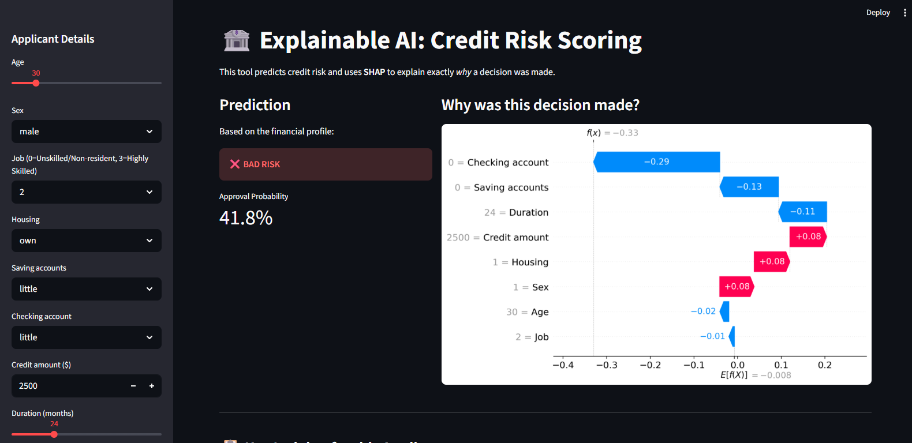
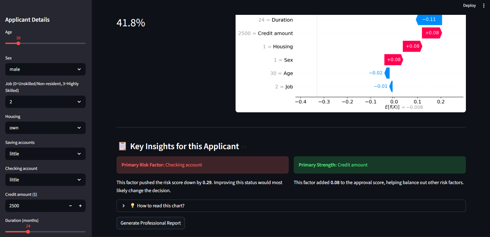

# Explainable Credit Risk Scoring Dashboard

## Project Overview
In modern finance, black-box models are not enough. Decisions must be transparent, explainable, and auditable.

This project is an end-to-end credit risk scoring system that combines XGBoost with SHAP to deliver accurate predictions along with understandable explanations using Explainable AI (XAI).

Users can input an applicant's financial profile and instantly receive:
* **A Probability Score** indicating credit risk (Approved vs. Declined).
* **A SHAP Waterfall Plot** showing exactly how each feature influenced the prediction.
* **A Downloadable PDF Audit Report** summarizing the decision for stakeholders.

---

## Tech Stack
* **Machine Learning:** XGBoost Classifier
* **Explainable AI:** SHAP (SHapley Additive exPlanations)
* **Frontend UI:** Streamlit
* **Data Processing:** Pandas, NumPy
* **Automated Reporting:** FPDF
* **Model Persistence:** Joblib

---

## Key Features
1. **Interactive UI:** Real-time adjustments using Streamlit sliders and dropdowns.
2. **Instant Inference:** Dynamic encoding via pre-trained `scikit-learn` LabelEncoders.
3. **Transparency:** Local SHAP explanations breaking down the exact push-and-pull of features (e.g., "Checking Account Status").
4. **Exportable Reports:** One-click generation of a professional PDF detailing the risk factors.

---

## System Architecture

`User Input` ➔ `Feature Encoding` ➔ `XGBoost Model` ➔ `Risk Prediction` ➔ `SHAP Explanation` ➔ `PDF Report Generation`

---

## Model Constraints

The XGBoost model incorporates monotonic constraints to enforce domain knowledge:
- **Account Balances:** Higher checking and savings balances strictly decrease default risk.
- **Loan Amount:** Higher requested credit amounts strictly increase default risk.
- **Loan Term:** Longer repayment durations strictly increase default risk.

This ensures predictions remain logically consistent and aligned with real-world financial principles, preventing the model from learning illogical patterns from noisy data.

---


## Example Prediction

**Input Profile:**
* **Checking Account:** Little 
* **Credit Amount:** $2,500 
* **Duration:** 24 months

**Model Output:**
* **Approval Probability:** 41.8% 
* **Decision:** ❌ DECLINED

**Explainable AI (SHAP) Breakdown:**
* 📉 **Primary Risk Factor:** *Checking account status* negatively impacted the score by -0.29.
* 📈 **Primary Strength:** *Credit amount* added +0.08 to the approval score, but it was not enough to overcome the primary risk factor.

---

## How to Run Locally

### 1. Clone the Repository
```bash
git clone https://github.com/Rihito2106/explainable-credit-risk-scoring.git
cd explainable-credit-risk-scoring
```

### 2. Environment Setup (Important!)
To avoid metadata compatibility issues between newer versions of XGBoost and SHAP, this project relies on a specific Conda environment:
```bash
conda create -n credit_env python=3.10 -y
conda activate credit_env
pip install -r requirements.txt
```

### 3. Launch the App
```bash
streamlit run app.py
```

---

## 🧠 Technical Challenges Overcome
* **Dependency:** Diagnosed and resolved a complex compatibility bug between XGBoost's JSON tree metadata and SHAP's TreeExplainer by isolating the project in a strict Conda environment using stable LTS versions (`xgboost==2.0.3`, `shap==0.45.1`).
* **Model Persistence:** Engineered a clean artifact-loading pipeline to ensure the Streamlit frontend can seamlessly deserialize the trained model and multiple categorical encoders without state-loss.

### 🖥️ Dashboard Preview




---

## 🚥 Project Status
✅ **Completed:** Local deployment, full XAI integration, and automated reporting.

**Future Improvements:**
* **Cloud Deployment:** Host the application on Streamlit Community Cloud or AWS/GCP.
* **API Integration:** Build a FastAPI endpoint to serve the XGBoost model to external applications.
* **Batch Processing:** Add functionality to upload a CSV of multiple applicants and generate a bulk risk report.
